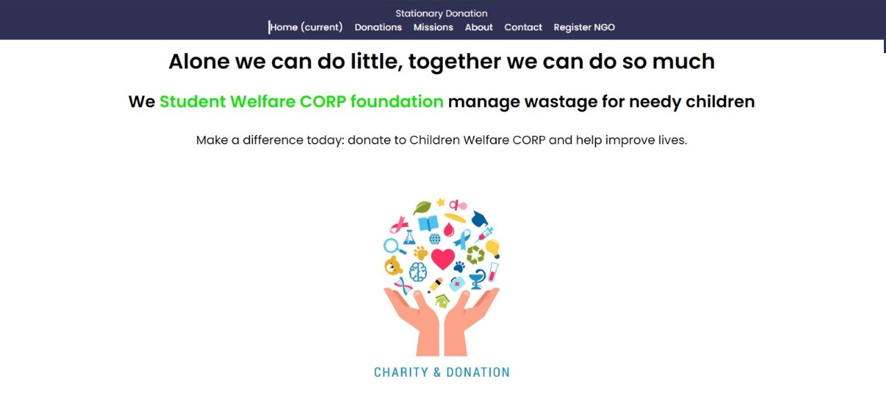
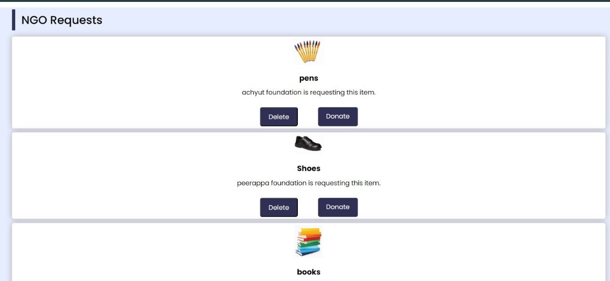
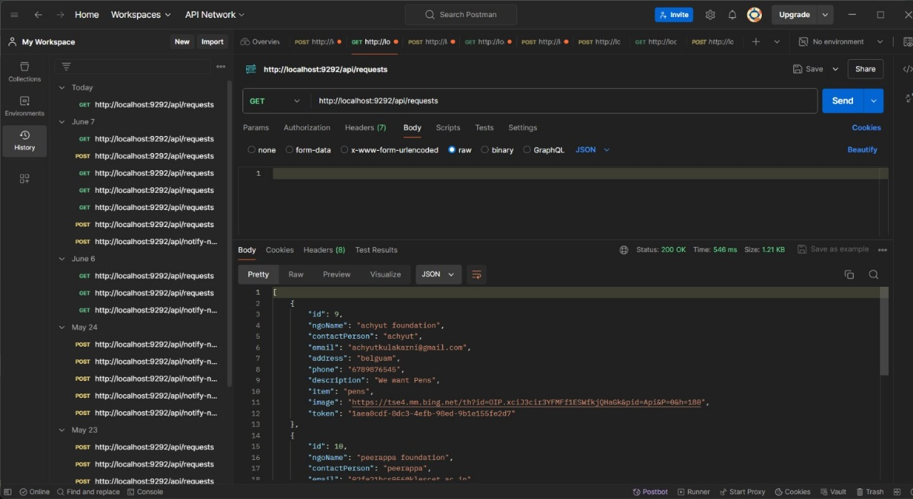
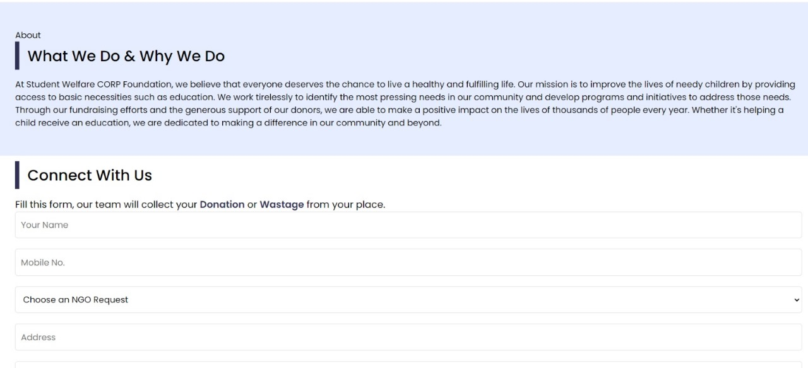
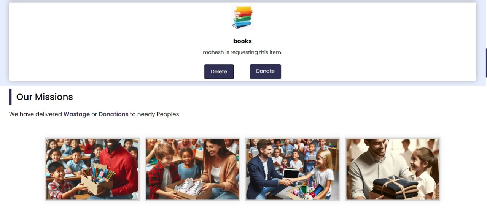
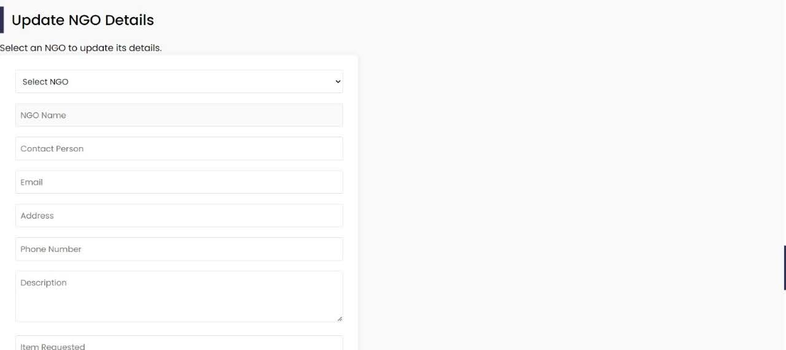
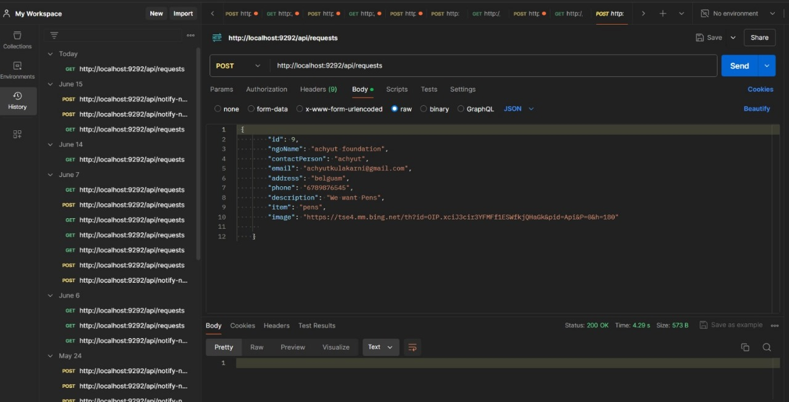

# 🩸 Donation Portal – Empowering Connectivity  

A fullstack web application to connect **donors and recipients**, built with **React.js (frontend)** and **Spring Boot (backend)** using **MySQL** for secure data storage.  

---
## 🚀 Features

* 🔐 Secure donor & recipient registration
* 📦 Manage donations and recipient requests
* Email communication between recipients and donors
* 📊 Database-backed storage (MySQL / H2 for quick testing)
* ⚡ RESTful APIs with Spring Boot*
* Recipient registration with photo & details.
*Unique token system to prevent unauthorized deletion of requests.
*All donation requests displayed publicly on the website.
*Donors can click Donate, fill details (name, address, number).
*Donor receives recipient details via email after submitting the form.
---


## 🚀 Tech Stack  
- Frontend: React.js  
- Backend: Spring Boot (Java)  
- Database: MySQL / H2  
- Tools: Maven, npm  

---

## 📂 Project Structure  
```
donation-portal/
 ├── backend/   # Spring Boot + MySQL/H2 (previously "demo")
 └── frontend/  # React.js (previously inside frontend/my-app)
```

---

## ⚙️ Setup Instructions  

### 1️⃣ Clone Repository  
```bash
git clone https://github.com/YOUR_USERNAME/donation-portal.git
cd donation-portal
```

---

### 2️⃣ Backend Setup (Spring Boot)  
```bash
cd backend
mvn spring-boot:run
```

➡️ Update `src/main/resources/application.properties` with DB credentials.  

**MySQL Example:**  
```properties
spring.datasource.url=jdbc:mysql://localhost:3306/donation_portal
spring.datasource.username=your-username
spring.datasource.password=your-password
spring.jpa.hibernate.ddl-auto=update
```

**H2 Example (in-memory DB):**  
```properties
spring.datasource.url=jdbc:h2:mem:testdb
spring.datasource.driverClassName=org.h2.Driver
spring.jpa.database-platform=org.hibernate.dialect.H2Dialect
spring.jpa.hibernate.ddl-auto=update
```

---

### 3️⃣ Frontend Setup (React.js)  
```bash
cd ../frontend
npm install
npm start
```
Runs on `http://localhost:3000/`  

---

## 🖼️ Project Screenshots

### 🏠 Home Page


*Landing page with navigation links and overview of the donation portal.*

---

### 📋 NGO Requests


*Displays donation/NGO requests submitted by different organizations.*

---

### 🔗 API Integration (Postman Testing)


*Testing backend APIs using Postman to ensure smooth donor–NGO communication.*

---

### ℹ️ About & Contact Form


*Information about the portal and contact form for communication.*

---

### 🎯 Missions Page


*Portal’s mission and vision statements to build trust with users.*

---

### 📝 Update NGO Details


*NGO can update their details/requests through the portal.*

---

### ➕ Add New NGO Request (Postman)


*Adding new NGO donation requests using backend API (Postman).*

---


---

## 📌 Future Enhancements    
- Cloud deployment (AWS/Heroku)  

---

## 👨‍💻 Author  
**Amit Raikar**  
- [LinkedIn](https://www.linkedin.com/in/amit-raikar-a06464265)  
- [GitHub](https://github.com/amitd05)  
